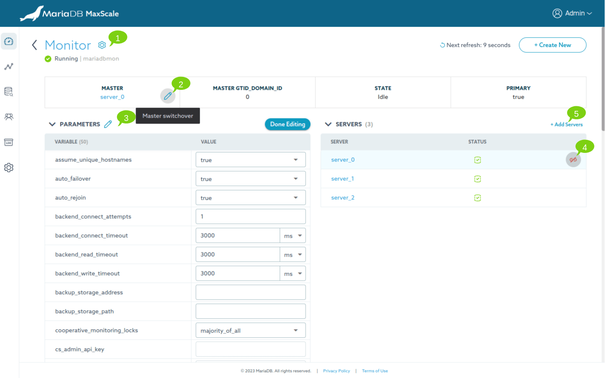
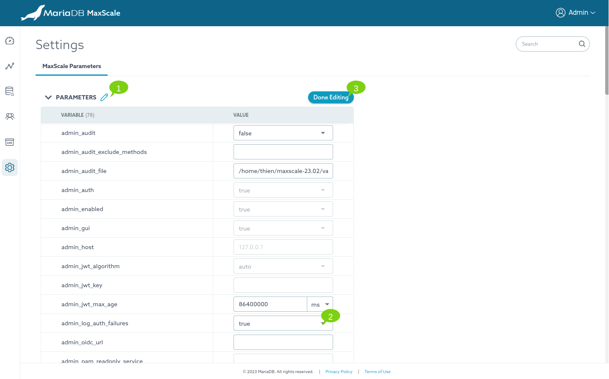

# Using MaxGUI Tutorial

[TOC]

# Introduction

This tutorial is an overview of what the MaxGUI offers as an alternative
solution to [MaxCtrl](../Reference/MaxCtrl.md).

# Dashboard

## Annotation

1.  [MaxScale object](../Getting-Started/Configuration-Guide.md#objects). i.e.
    Service, Server, Monitor, Filter, and Listener (Clicking on it will navigate
    to its detail page)
2.  Create a new MaxScale object.
3.  Dashboard Tab Navigation.
4.  Search Input. This can be used as a quick way to search for a keyword in
    tables.
5.  Dashboard graphs. Refresh interval is 10 seconds.
    - SESSIONS graph illustrates the total number of current sessions.
    - CONNECTIONS graph shows servers current connections.
    - LOAD graph shows the last second load of thread.
6.  Logout of the app.
7.  Sidebar navigation menu. Access to the following pages: Dashboard,
    Visualization, Settings, Logs Archive, Query Editor

## Create a new MaxScale object

Clicking on the _Create New_ button (Annotation 2) to open a dialog for creating
a new object.

## View Replication Status

The replication status of a server monitored by
[MariaDB-Monitor](../Monitors/MariaDB-Monitor.md) can be viewed by mousing over
the server name. A tooltip will be displayed with the following information:
replication_state, seconds_behind_master, slave_io_running, slave_sql_running.

# Detail

This page shows information on each MaxScale object and allow to edit its
parameter, relationships and perform other manipulation operations. Most of the
control buttons will be shown on the mouseover event. Below is a screenshot of a
Monitor Detail page, other Detail pages also have a similar layout structure so
this is used for illustration purpose.

## Annotation

1.  Settings option. Clicking on the gear icon will show icons allowing to do
    different operations depending on the type of the Detail page.
    - Monitor Detail page, there are icons to Stop, Start, and Destroy monitor.
    - Service Detail page, there are icons to Stop, Start, and Destroy service.
    - Server Detail page, there are icons to Set maintenance mode, Clear server
      state, Drain and Delete server.
    - Filter and Listener Detail page, there is a delete icon to delete the
      object.
2.  Switchover button. This button is shown on the mouseover event allowing to
    swap the running primary server with a designated secondary server.
3.  Edit parameters button. This button is shown on the mouseover event allowing
    to edit the MaxScale object's parameter. Clicking on it will enable editable
    mode on the table. After finishing editing the parameters, simply click the
    _Done Editing_ button.
4.  A Detail page has tables showing "Relationship" between other MaxScale
    object. This "unlink" icon is shown on the mouseover event allowing to
    remove the relationship between two objects.
5.  This button is used to link other MaxScale objects to the relationship.

# Settings

This page shows and allows editing of MaxScale parameters.

## Annotation

1.  Edit parameters button. This button is shown on the mouseover event allowing
    to edit the MaxScale parameter. Clicking on it will enable editable mode on
    the table..
2.  Editable parameters are visible as it's illustrated in the screenshot.
3.  After finishing editing the parameters, simply click the _Done Editing_
    button.

# Logs Archive

This page show real-time MaxScale logs with filter options.

## Annotation

1.  Filter by dropdown. All logs types are selected to be shown by default
2.  Uncheck the box to disable showing a particular log type.
